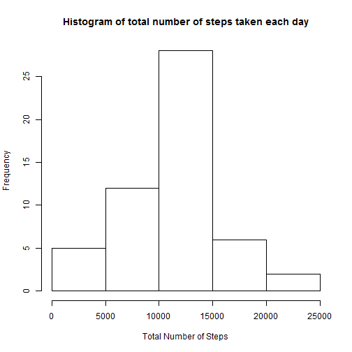
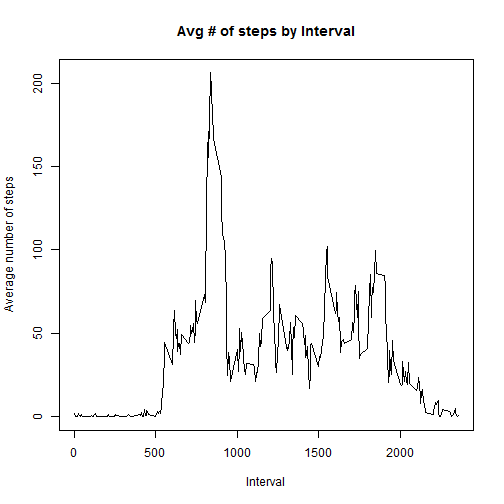
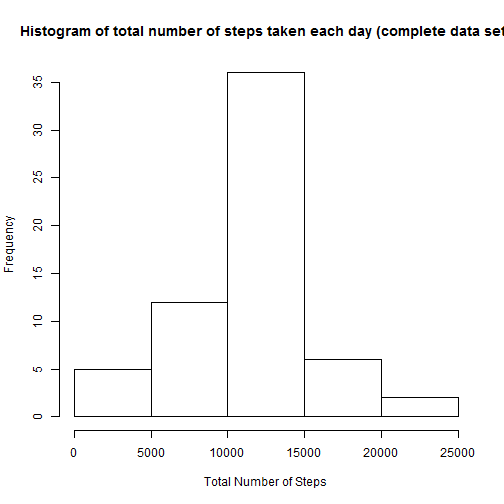
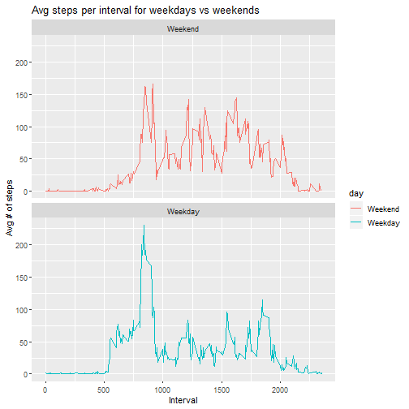

## Loading and preprocessing the data
Downloading data

```r
setwd("~/Data Science/Files/5/")
url<-"https://d396qusza40orc.cloudfront.net/repdata%2Fdata%2Factivity.zip"
if (!file.exists('./repdata%2Fdata%2Factivity.zip')){
        download.file(url,destfile<-'repdata%2Fdata%2Factivity.zip', mode = 'wb')
        unzip('repdata%2Fdata%2Factivity.zip', exdir = getwd())}
```

Read data and data formatting transformations

```r
activity<-read.csv('activity.csv',header=TRUE)
activity$date<-as.Date(activity$date)
```


## What is mean total number of steps taken per day? (Missing values are ignored)
1. Calculate the total number of steps taken per day

```r
total_steps_per_day<-aggregate(steps ~ date,activity, sum)
total_steps_per_day
```

```
##          date steps
## 1  2012-10-02   126
## 2  2012-10-03 11352
## 3  2012-10-04 12116
## 4  2012-10-05 13294
## 5  2012-10-06 15420
## 6  2012-10-07 11015
## 7  2012-10-09 12811
## 8  2012-10-10  9900
## 9  2012-10-11 10304
## 10 2012-10-12 17382
## 11 2012-10-13 12426
## 12 2012-10-14 15098
## 13 2012-10-15 10139
## 14 2012-10-16 15084
## 15 2012-10-17 13452
## 16 2012-10-18 10056
## 17 2012-10-19 11829
## 18 2012-10-20 10395
## 19 2012-10-21  8821
## 20 2012-10-22 13460
## 21 2012-10-23  8918
## 22 2012-10-24  8355
## 23 2012-10-25  2492
## 24 2012-10-26  6778
## 25 2012-10-27 10119
## 26 2012-10-28 11458
## 27 2012-10-29  5018
## 28 2012-10-30  9819
## 29 2012-10-31 15414
## 30 2012-11-02 10600
## 31 2012-11-03 10571
## 32 2012-11-05 10439
## 33 2012-11-06  8334
## 34 2012-11-07 12883
## 35 2012-11-08  3219
## 36 2012-11-11 12608
## 37 2012-11-12 10765
## 38 2012-11-13  7336
## 39 2012-11-15    41
## 40 2012-11-16  5441
## 41 2012-11-17 14339
## 42 2012-11-18 15110
## 43 2012-11-19  8841
## 44 2012-11-20  4472
## 45 2012-11-21 12787
## 46 2012-11-22 20427
## 47 2012-11-23 21194
## 48 2012-11-24 14478
## 49 2012-11-25 11834
## 50 2012-11-26 11162
## 51 2012-11-27 13646
## 52 2012-11-28 10183
## 53 2012-11-29  7047
```
2. Make a histogram of the total number of steps taken each day

```r
hist(total_steps_per_day$steps,xlab='Total Number of Steps',main='Histogram of total number of steps taken each day')
```



3. Calculate and report the mean and median of the total number of steps taken per day

```r
mean(total_steps_per_day$steps,na.rm = TRUE)
```

```
## [1] 10766.19
```

```r
median(total_steps_per_day$steps,na.rm = TRUE)
```

```
## [1] 10765
```


## What is the average daily activity pattern? (Missing values are ignored)
1. Make a time series plot (i.e. type = "l") of the 5-minute interval (x-axis) and the average number of steps taken, averaged across all days (y-axis)


```r
avg_step_per_interval<-aggregate(steps ~ interval,activity, mean)
plot(type='l',x=avg_step_per_interval$interval,y=avg_step_per_interval$steps,
     xlab='Interval',ylab='Average number of steps',main='Avg # of steps by Interval')
```



2. Which 5-minute interval, on average across all the days in the dataset, contains the maximum number of steps?

```r
## computing the interval where the max steps occur
avg_step_per_interval[avg_step_per_interval$steps==max(avg_step_per_interval$steps),1]
```

```
## [1] 835
```


## Imputing missing values
Note that there are a number of days/intervals where there are missing values (NA). The presence of missing days may introduce bias into some calculations or summaries of the data.

1. Calculate and report the total number of missing values in the dataset (i.e. the total number of rows with NAs)


```r
na<-activity[is.na(activity$steps),]
nrow(na)
```

```
## [1] 2304
```

2. Devise a strategy for filling in all of the missing values in the dataset. The strategy does not need to be sophisticated. For example, you could use the mean/median for that day, or the mean for that 5-minute interval, etc.


```r
## Since the average steps for each 5 minute interval is computed already,
## I will use the average steps for that 5 minute interval to fill in the 
## miss values. (This strategy is used because it's convenient)
```

3. Create a new dataset that is equal to the original dataset but with the missing data filled in.


```r
## copy activity data to complete data
complete_data<-activity

## loop over complete data to fill in misssing values by looking up values (by interval) from the avg steps that were computed before
for (i in 1:nrow(complete_data)){
    if(is.na(complete_data[i,1])==TRUE){
            complete_data[i,1]<-avg_step_per_interval[(avg_step_per_interval$interval==complete_data[i,3]),2]
            
    }
}

## Run a summary of complete data to test
## test that there is no NAs any more
nrow(complete_data[is.na(complete_data$steps),])
```

```
## [1] 0
```

```r
## test that values are filled in
summary(complete_data)
```

```
##      steps             date               interval     
##  Min.   :  0.00   Min.   :2012-10-01   Min.   :   0.0  
##  1st Qu.:  0.00   1st Qu.:2012-10-16   1st Qu.: 588.8  
##  Median :  0.00   Median :2012-10-31   Median :1177.5  
##  Mean   : 37.38   Mean   :2012-10-31   Mean   :1177.5  
##  3rd Qu.: 27.00   3rd Qu.:2012-11-15   3rd Qu.:1766.2  
##  Max.   :806.00   Max.   :2012-11-30   Max.   :2355.0
```

4. Make a histogram of the total number of steps taken each day and Calculate and report the mean and median total number of steps taken per day. Do these values differ from the estimates from the first part of the assignment? What is the impact of imputing missing data on the estimates of the total daily number of steps?


```r
## aggregate data and generate histogram
total_steps_per_day_1<-aggregate(steps ~ date,complete_data, sum)
hist(total_steps_per_day_1$steps,xlab='Total Number of Steps',main='Histogram of total number of steps taken each day (complete data set)')
```



```r
## computing mean and median
mean(total_steps_per_day_1$steps)
```

```
## [1] 10766.19
```

```r
median(total_steps_per_day_1$steps)
```

```
## [1] 10766.19
```

The mean stays the same and the median changes slightly. It makes sense because we used mean value to fill in missing values. Median is impacted beacuse both the # of observation and the steps sequence change. The mean and median value change will depend upon what strategy is used to input missing values.


## Are there differences in activity patterns between weekdays and weekends? (Complete data set is used)
1. Create a new factor variable in the dataset with two levels – “weekday” and “weekend” indicating whether a given date is a weekday or weekend day.

```r
complete_data$day<-weekdays(complete_data$date)
wkdays<- c('Monday', 'Tuesday', 'Wednesday', 'Thursday', 'Friday')
complete_data$day<-factor((complete_data$day %in% wkdays), 
         levels=c(FALSE, TRUE), labels=c('Weekend', 'Weekday'))
```

2.Make a panel plot containing a time series plot (i.e.type="l") of the 5-minute interval (x-axis) and the average number of steps taken, averaged across all weekday days or weekend days (y-axis). See the README file in the GitHub repository to see an example of what this plot should look like using simulated data.

```r
## aggregate data
avg_step_per_interval_1<-aggregate(complete_data$steps,list(complete_data$interval,complete_data$day), mean) 
names(avg_step_per_interval_1)<-c('interval','day','steps')

## install.packages('ggplot2')
library(ggplot2)

ggplot(avg_step_per_interval_1, aes(interval, steps)) + 
        geom_line(aes(color = day), stat = "identity") + facet_grid(. ~ day)+
        ggtitle("Avg steps per interval for weekdays vs weekends")+
        xlab('Interval')+ylab("Avg # of steps")+facet_wrap(~day , ncol = 1, nrow=2)
```



